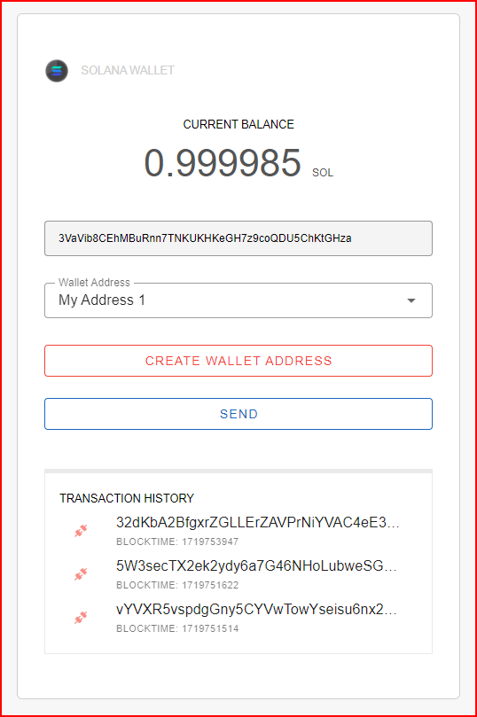

# Solana Wallet

A simple Solana wallet that uses web3.js to execute transactions and query wallet information.

> **Note:** This project is for my study purposes only.



## Technology Stack
- Solana Web3.js
- Vue.js
- Vuetify

## Development

### Install Packages/Node Modules
To install the required packages and node modules, run:
```sh
yarn
```

### Launch Development Environment
To launch the development environment, run:
```sh
yarn dev
```

### Build
To build the project, run:
```sh
yarn build
```

## Configuration
You can change the RPC Endpoint Address in `src/config.js`:
```js
export const RPC_ADDRESS = "http://localhost:8899/";
```

## Extras
You can use the Solana test validator as your RPC endpoint for development.
